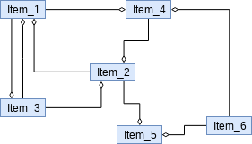
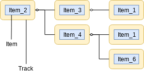
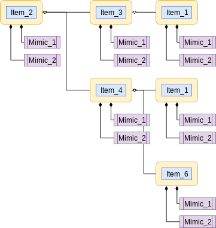

Introduction
===============

Applications which deal with data are required to update their user interfaces
enough frequently so that users can access to the latest data.

Updating a gui widget whenever data is updated seems pretty easy, and
it's actually easy to implement. However if the number of data is variable,
and user interface is required to cope with the change, it brings complicated
issues.

*Trackable, Mimickable Shared Data* is a library which shows how data
which forms
complex web of containing relationshiop can be efficiently displayed and
updated on user interface.

TMSD introduces a concept *Item*. *Item* can contain data, and refer other
*Item*\ s. In this way, by using *Item*, almost all kinds of data structure,
including graph, map, list, set, and combinations of them, can be
implemented.

*Item* serves too much freedom in describing data, and it cannot be used in
user interface right away. For example, graph-like data cannot be painted on
graphics-item-list widget. Recurrent referring relationship is another
trouble. So TMSD does process *tracking*, which is creating tree-structure
placeholders of *Item*.

The first image shows complex containing relationship among several *Item*\ s,
and the second image is well-structured tree of *Track*, which is placeholder
of ``Item``. Forming tree with *Track* object is called *tracking* in TMSD.

*Track information* tells the *tracking* algorithm about which child
*Item*\ s need to be tracked. This limits unwanted data to be shown on the
tree, and prevents unlimited recurrent.

*Track* is only a placeholder type for *Item*, and actual gui widget or
user interface representation is separated into *Mimic* concept.
This not only makes concepts clearly, but also helps multiple *Mimic* objects
can be attached to one *Track* tree.

*Mimic* object can be anything, but in most cases, they are gui widgets to
paint its *Item* object's data. Whenever other *Item* instance is added as
*tracking* target, *Track* instance will be created as well, and
construction of *Mimic* objects will be accompanied as well. In this way,
TMSD provides uniform way to handle complex data structure.
